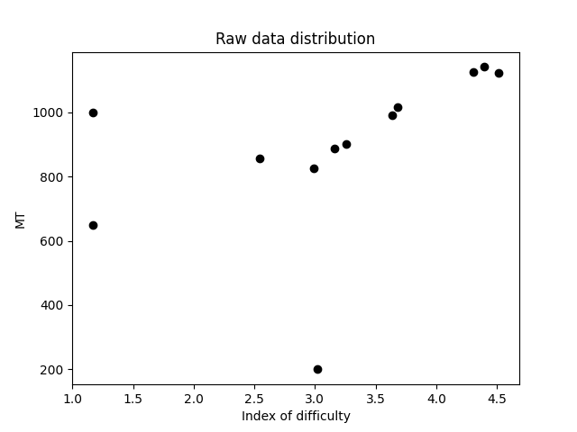
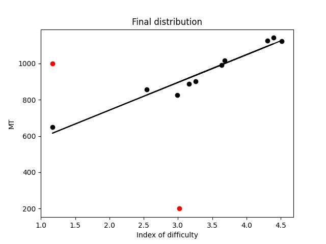

# A toy version of Fitts' Law

File study_data.csv contains part of the actual study result from Berkeley Fitts Law Dataset (http://automation.berkeley.edu/fitts-dataset/). The code shows how the Fitts' Law coefficients are calculated and visualize the results. 

## Running the program 

sklearn is required. Then run: 
```bash
python3 simple_fitts_law.py
```

The result before outlier removal will be visualized in the same folder:


The result after outlier removal is as follow. The black dots are the inliers and the red dots are the outliers.


## RANSAC (Random sample consensus)

Ransac is one of the most most commonly used method to remove outliers; which is especially useful when the data is quite noisy. The program contains RANSAC. You just need to change the iteration number and threshold in line 82, 83.

```bash
steps = 2000
thres = 1
```

The more steps give, it will find better line. The threshold determines how centered the points should be. Set the threshold high could include more points but potentially include more noisy points as well.